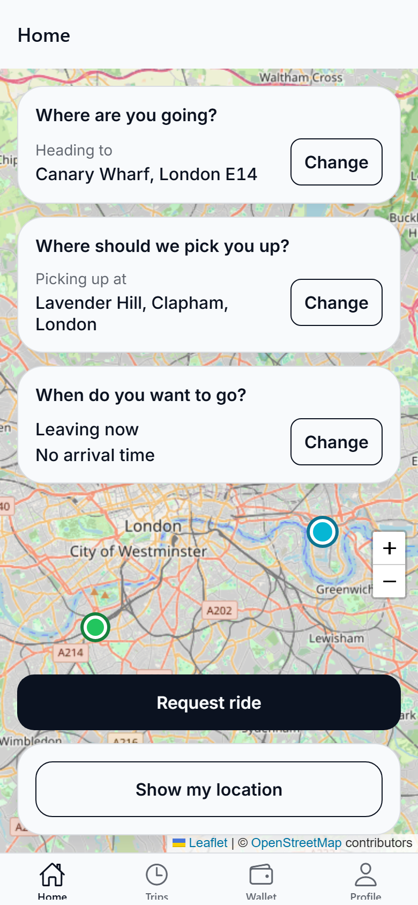
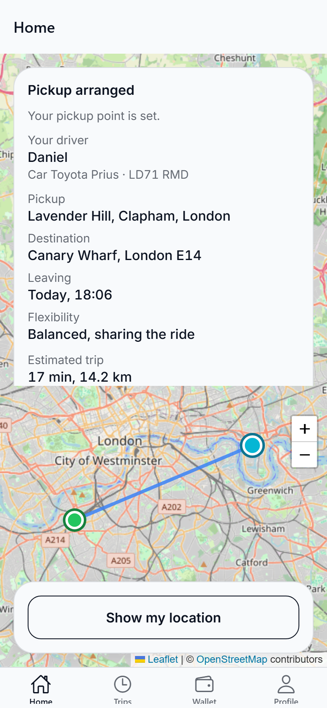
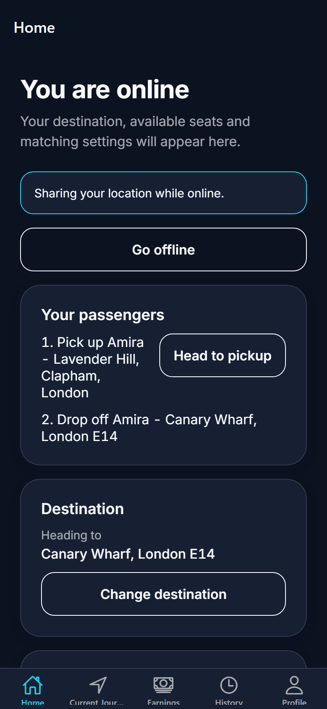
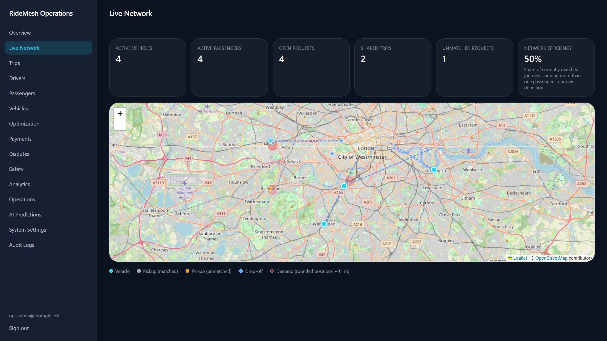
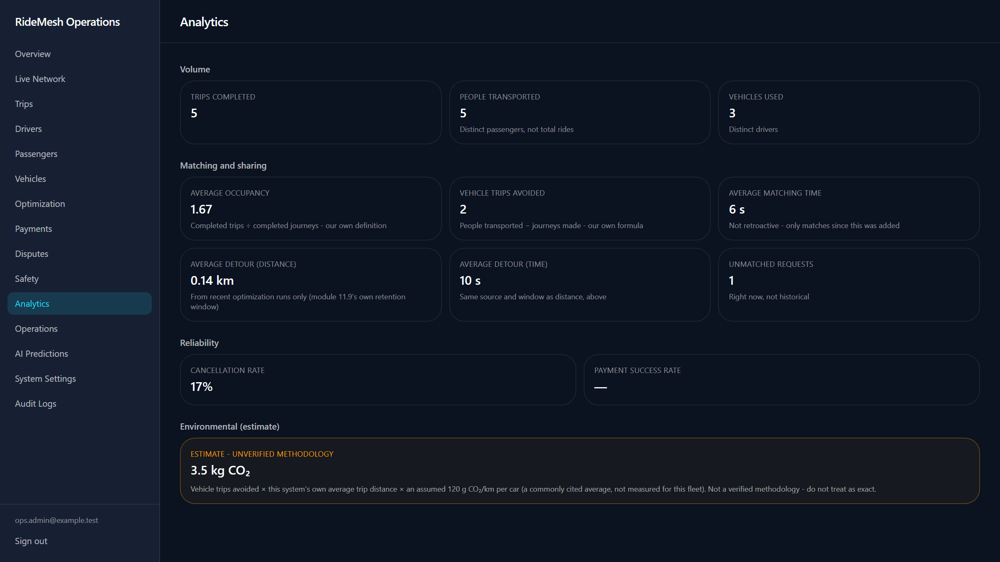
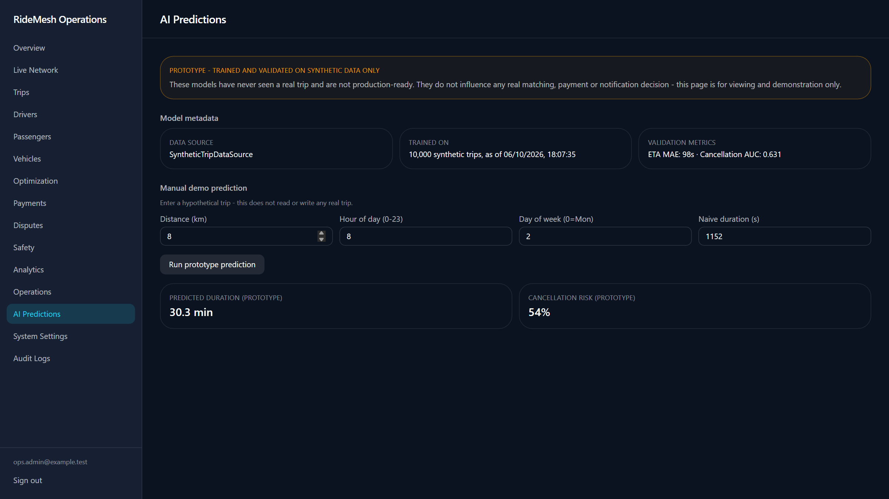
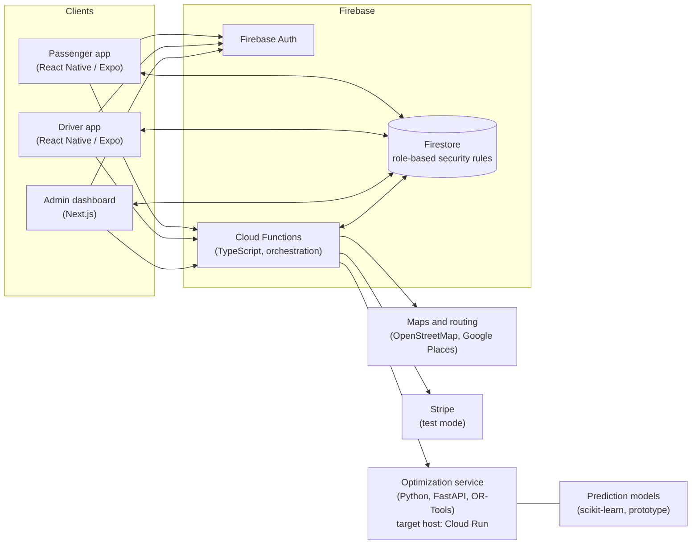

<div align="center">

# RideMesh

**AI-assisted carpooling that matches passengers into journeys drivers are already making.**

[](apps/passenger)
[](apps/admin)
[](functions)
[](services/optimization)
[](functions/src)
[](tsconfig.json)

</div>

> **A portfolio / demo project.** Everything in the screenshots and the video runs locally against
> Firebase emulators on demo data. Payments are in Stripe test mode (no real charges) and the AI
> predictions are a prototype trained on synthetic data. See [Known limitations](#known-limitations).

**Demo video:** [ADD THE VIDEO LINK HERE](#)

## Why RideMesh is different

A typical ride-hailing app answers one question: _which car is nearest to this person?_ That sends a
new vehicle for every rider, even when ten people are travelling the same way at the same time.

RideMesh asks a different question: **which combination of journeys moves the most people with the
fewest vehicle trips?** Drivers declare a journey they are making anyway. Passengers state how much
they are willing to bend: how far they will walk, how much extra time they accept, whether they will
share. An optimization engine then weighs every open request against every journey in progress and
builds the plan that serves the most people with the least extra driving, without ever breaking
anyone's stated limits.

Two design rules keep it honest: **optimization decides, AI only predicts.** Assignments come from a
deterministic OR-Tools model that can explain each decision, and machine learning is limited to
prediction. No model, and no LLM, controls routing or safety constraints.

## Screenshots

All screenshots are real captures of the running apps on seeded demo data (London commuter routes).

|                                                       Passenger: ask for a ride                                                       |                                                  Passenger: matched to a driver                                                   |                                                Driver: a matched passenger                                                |
| :-----------------------------------------------------------------------------------------------------------------------------------: | :-------------------------------------------------------------------------------------------------------------------------------: | :-----------------------------------------------------------------------------------------------------------------------: |
|  |  |  |
|                               Pick a destination and pickup, say when to leave and how flexible to be.                                |                                 The optimizer pairs the request with a journey already under way.                                 |                          The driver sees pickup and drop-off in order and moves the trip along.                           |

**Operations dashboard**



|                                                                   Analytics                                                                    |                                                       AI predictions (prototype)                                                       |
| :--------------------------------------------------------------------------------------------------------------------------------------------: | :------------------------------------------------------------------------------------------------------------------------------------: |
|  |  |

## Key features

### For passengers

- **Request a ride in a few taps:** search a destination and pickup on a live map, leave now or up to
  7 days ahead, with an optional arrive-by time.
- **Say how flexible you are:** Strict, Balanced or Flexible, with limits on walking distance, extra
  time and route change, and whether you will share. The system never goes past them.
- **Know what is happening:** the ride card moves from _Finding your ride_ to _Pickup arranged_, shows
  your driver and vehicle, and follows the trip until drop-off.

### For drivers

- **Drive where you were going anyway:** set a destination, the seats you offer and the longest detour
  you will accept, then go online and share your position.
- **A clear path to going online:** a checklist shows exactly what is missing (verified profile,
  verified vehicle, seats, destination, detour limit).
- **Run the trip from one screen:** matched passengers appear in the order the optimizer chose, with
  one action per step: head to pickup, confirm pickup, start trip, approaching drop-off, complete.

### For operations staff

- **Live network:** vehicles, passengers waiting, open requests, demand and shared-trip efficiency on
  one map.
- **Trust and safety workflow:** staff verify drivers and vehicles before anyone can go online, review
  disputed trips, and sensitive actions are recorded in an **audit log**.
- **See why the optimizer decided what it did:** each batch run records what it considered, the plans it
  built and a reason for every request, matched or not.
- **Analytics:** occupancy, vehicle trips avoided, matching time, detour and cancellations, with each
  number's definition stated on the page (and the CO2 figure clearly labelled as an estimate).
- **Operations panel:** daily counters for caught function failures and route-lookup problems.

## Architecture



**How a match happens:** a passenger's request is validated and stored by a Cloud Function and moves to
_searching_. A periodic batch run (every two minutes in production) gathers open requests and journeys
in progress, filters candidates by distance and direction, and sends them to the Python service. The
OR-Tools model returns the plans and an explanation per request; the function then writes the
assignments, which reach both apps live through Firestore.

More detail: [docs/architecture.md](docs/architecture.md).

## Tech stack, and why

| Layer           | Choice                                                    | Why                                                                                                                                 |
| --------------- | --------------------------------------------------------- | ----------------------------------------------------------------------------------------------------------------------------------- |
| Mobile apps     | React Native + Expo, TypeScript                           | One codebase for the passenger and driver apps; the same code also runs in a browser, which makes end-to-end testing realistic.     |
| Admin dashboard | Next.js + Tailwind                                        | A fast, server-capable web app for staff, easy to host.                                                                             |
| Backend         | Firebase Auth, Firestore, Cloud Functions                 | Real-time sync to every screen without running servers; security rules enforce roles at the data layer.                             |
| Optimization    | Python, FastAPI, Google OR-Tools                          | Routing and assignment is a constraint-optimization problem; OR-Tools is built for it, and a separate service can scale on its own. |
| Predictions     | scikit-learn                                              | Small, inspectable models for ETA and cancellation prediction, kept apart from decision-making.                                     |
| Payments        | Stripe (test mode)                                        | Authorization, capture, refund and webhook handling for ride payments (test mode only).                                             |
| Quality         | Vitest, Playwright, Firebase emulators, strict TypeScript | Business rules are tested against the real rules and functions, not mocks.                                                          |

Monorepo with npm workspaces; shared packages (`types`, `firebase`, `ui`, `map`, `maps`,
`mobile-auth`) keep the three apps consistent.

## Engineering quality

- **Tested at several levels.** Over 700 unit tests, more than 900 emulator-backed integration tests
  (security rules, Cloud Functions and the real Python optimizer in one acceptance test), and
  Playwright end-to-end tests that drive the real app screens. CI runs verification and end-to-end
  tests on every pull request.
- **Load-tested a hard case.** 50 route estimates requested at the same moment were all served after
  the route-lookup limiter was redesigned (found and fixed through measurement, documented in
  [docs/load-testing.md](docs/load-testing.md)).
- **Security and privacy written down.** Role-based access, an audit trail, retention and
  account-deletion decisions and a payment-compliance review are documented in
  [docs/security.md](docs/security.md), including what is deliberately not built and why.
- **Honest about gaps.** Where a metric has no trustworthy definition, the dashboard shows a dash and a
  note, not an invented number.

## Project scope

RideMesh was built module by module against a written, phased specification, with each module
finishing its own tests, lint, type checks and documentation before the next began. Every phase of the
specification is complete **except the final production-deployment module**, which is the next step.

## Getting started

Requirements: Node.js 22+, npm 10+, the Firebase CLI, Java 21+ (Firestore emulator) and Python 3.12
(optimization service).

```bash
npm install
npm run verify            # format check, lint, type check, unit tests

npm run emulators         # Firebase emulators (Auth, Firestore, Functions)
npm run dev:admin         # http://localhost:3000
npm run dev:passenger     # Expo dev server
npm run dev:driver        # Expo dev server
```

The optimization service (see [services/optimization](services/optimization)):

```bash
cd services/optimization
python -m venv .venv && .venv/Scripts/activate   # or: source .venv/bin/activate
pip install -r requirements.txt
uvicorn app.main:app --port 8080
```

Environment variables, test commands and the Git workflow are in
[docs/development.md](docs/development.md); real values live in git-ignored local files and are
never committed.

## Repository layout

```text
apps/
  passenger/        Expo (React Native) passenger app
  driver/           Expo (React Native) driver app
  admin/            Next.js operations dashboard
functions/          Firebase Cloud Functions (TypeScript)
services/
  optimization/     Python optimization service (FastAPI + OR-Tools)
packages/           Shared: types, firebase, ui, map, maps, mobile-auth, config
docs/               Architecture, security, performance, load testing, development
tests/              Integration, end-to-end and load tests
```

## Known limitations

- **Demo project, not a live service.** It has not been deployed to production, and payments run in
  Stripe test mode.
- **AI predictions are a prototype** trained and validated on synthetic data only; they do not
  influence any real match, payment or notification.
- **Driver payouts and an earnings screen are not built** (deliberately; see
  [docs/security.md](docs/security.md)).
- **Some metrics are intentionally absent:** matching success rate, average walking distance and API
  error counts have no trustworthy definition yet, and are documented as not built.
- **Some UI states are unverified:** a matrix of failure-recovery screens is documented as not yet
  checked. Mobile apps have been exercised in the browser build, not on a range of physical devices.
- **Local demo routing is simulated.** Route lines and estimates in the screenshots come from a stand-in
  route server (straight lines); production uses a real routing provider.

## Documentation

- [Architecture](docs/architecture.md)
- [Development guide, Git workflow and conventions](docs/development.md)
- [Roles, access, security and payment compliance](docs/security.md)
- [Performance](docs/performance.md) and [load testing](docs/load-testing.md)
- [Backup strategy](docs/backup.md) and [app store readiness](docs/app-store-readiness.md)

## Author

**Zaira Shahid**

- Portfolio: [ADD LINK](#)
- LinkedIn: [ADD LINK](#)
- GitHub: [@Zaira-Shahid](https://github.com/Zaira-Shahid)
- Email: ADD EMAIL
